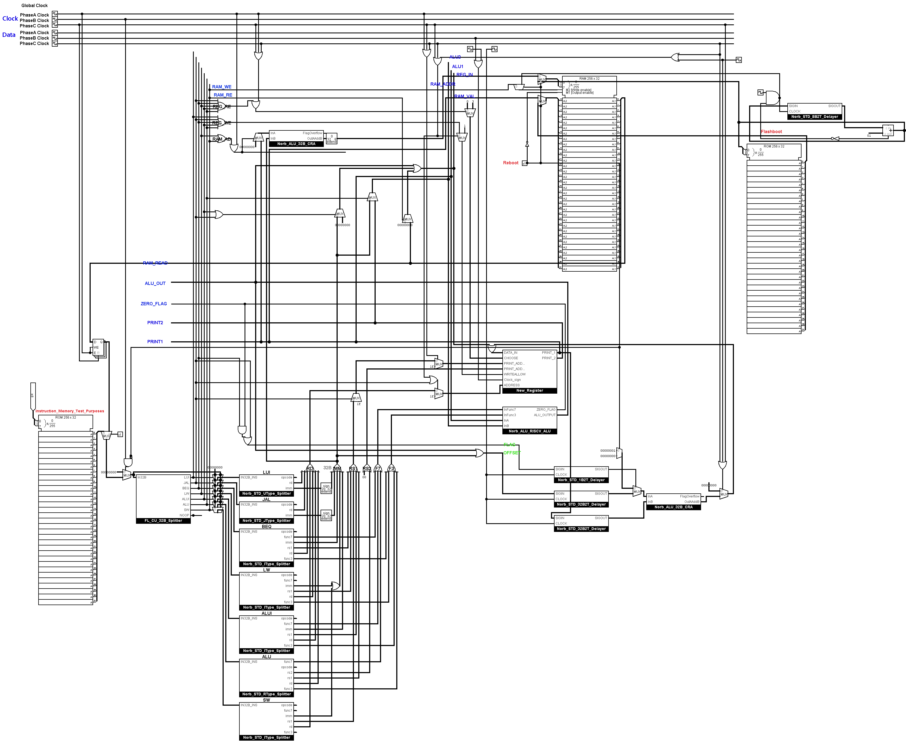

# Logisim-RISCV
A RISCV implementation in Logisim Evolution.

Note that this implementation is experimental, and some functinoalities are not implemented. Yet the result is Turing Complete and it has been a greatly educating experience.

---

This project is for personal learning only. Feel free to give a star if you like it, but please do not use it in production settings.